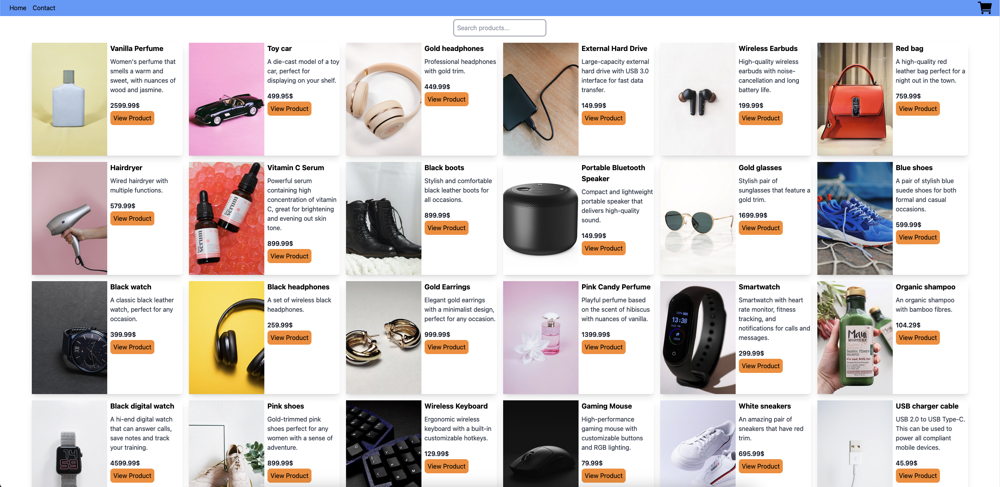

# Front-end Frameworks CA



This is my first project using React, where I built a fully functional e-commerce store using the Noroff Online Shop API. The store includes essential e-commerce features such as product listings, a search bar, dynamic product pages, a shopping cart, a checkout process, and a contact form with validation.

## Features

- **Product Listing** – Displays all products on the homepage with a search bar for filtering.
- **Product Details Page** – Shows individual product details, including images, descriptions, prices, and reviews.
- **Shopping Cart** – Users can add/remove products, view totals, and proceed to checkout.
- **Checkout Flow** – The checkout success page confirms purchases and clears the cart.
- **Discount Display** – Automatically calculates and displays discounts when applicable.
- **Contact Form** – Includes validation for full name, subject, email, and message.
- **React Router Navigation** – Seamless page transitions using React Router.
- **Responsive Design** – Optimized for various screen sizes.

## Technologies Used

- React
- React Router
- JavaScript (ES6+)
- TailwindCSS
- Noroff Online Shop API

## Setup Instructions

To set up the project locally, follow these steps:

1. **Clone the repository**:

```
git clone https://github.com/Bakek-lang/fef-ca.git
```

2. **Install dependencies:**:

```
npm install
```

3. **Run the development server:**

```
npm run dev
```

4. **Build the project for production**:

```
npm run build
```

5. **Preview the production build**:

```
npm run preview
```
